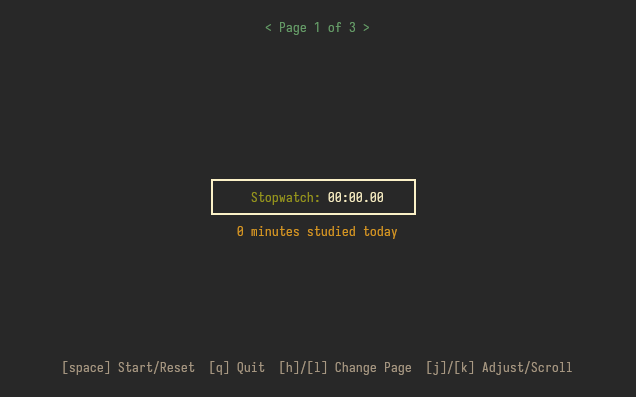
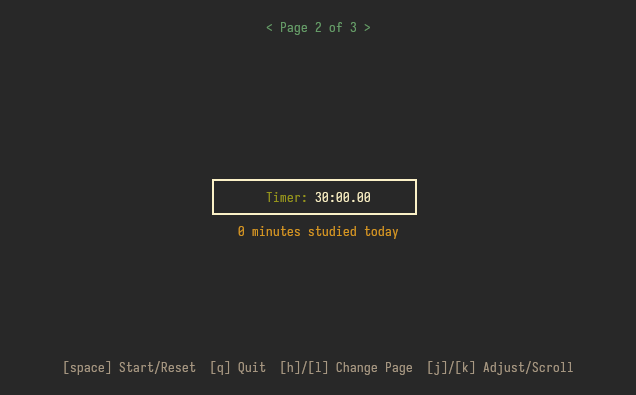
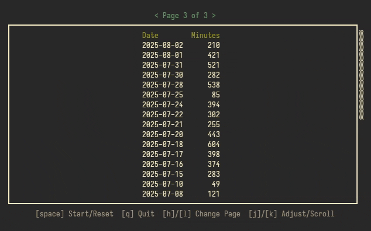

# stutui

A minimalist terminal‐based study timer and stopwatch with daily logging, built on ncurses.

## Features
- Stopwatch to track elapsed time while studying.
- Countdown timer with adjustable duration.
- Daily log of minutes studied saved in a local file (~/.config/stutui.log).
- Interactive terminal UI with pages for stopwatch, timer, and logs.
- Vim-like control scheme.
- Distraction free minimalism.

## Screenshots




## Prerequisites
- "ncurses" development library
- C compiler (e.g., gcc, clang)

#### Debian / Ubuntu
```bash
sudo apt update
sudo apt install build-essential libncurses-dev
```
#### Fedora
```bash
sudo dnf install gcc ncurses-devel
```

## Installation
#### Arch (AUR)
```bash
paru -S stutui
#or
yay -S stutui
```
#### Manual (Other Distros)
1. Clone the repository:
```bash
git clone https://gitlab.com/sizinicin/stutui.git
cd stutui
```
2. Build the executable:
```bash
gcc stutui.c -o stutui -lncurses
```
3. (Optional) Install system-wide:
```bash
sudo install -Dm755 stutui /usr/local/bin/stutui
```
## Usage
Run the program:
```bash
./stutui
# or, if installed system-wide:
stutui
```
## Controls
- `[space]` : Start/Reset stopwatch or timer
- `[q]`     : Quit
- `[h]`/`[l]`: Switch pages
- `[j]`/`[k]`: Adjust timer minutes or scroll logs

## Configuration
Default timer duration is set in `~/.config/stutui/stutui.conf` under the `default-timer` key.

## LICENSE
This project is licensed under the terms of the GPL-3.0 license. See the LICENSE file for details.
